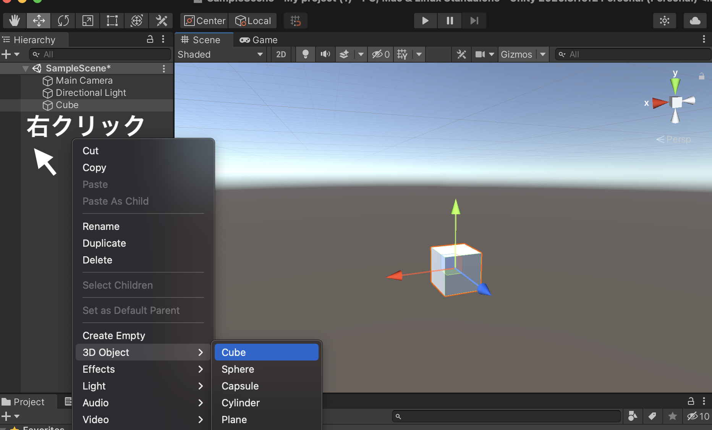
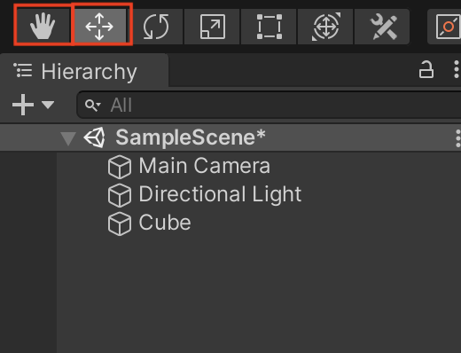
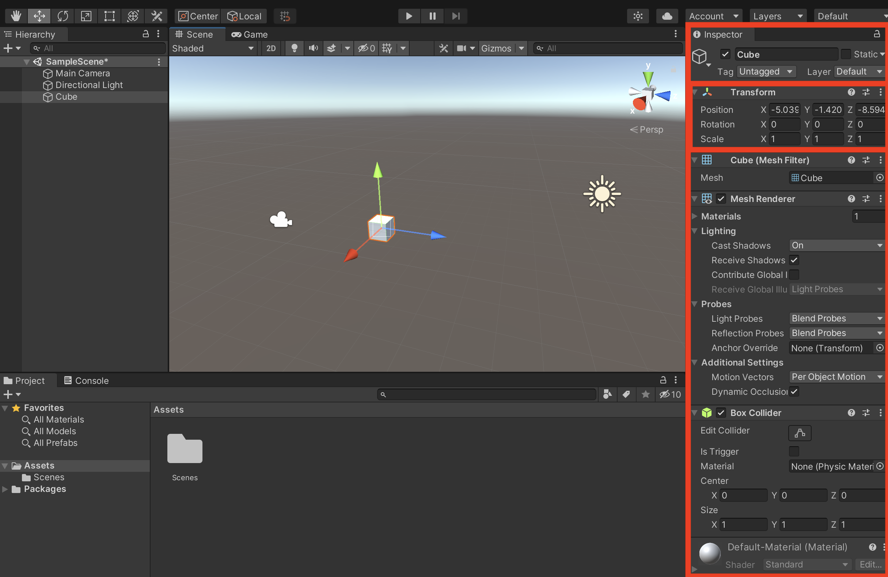
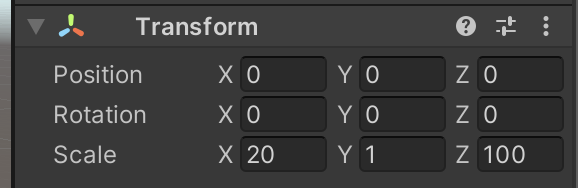
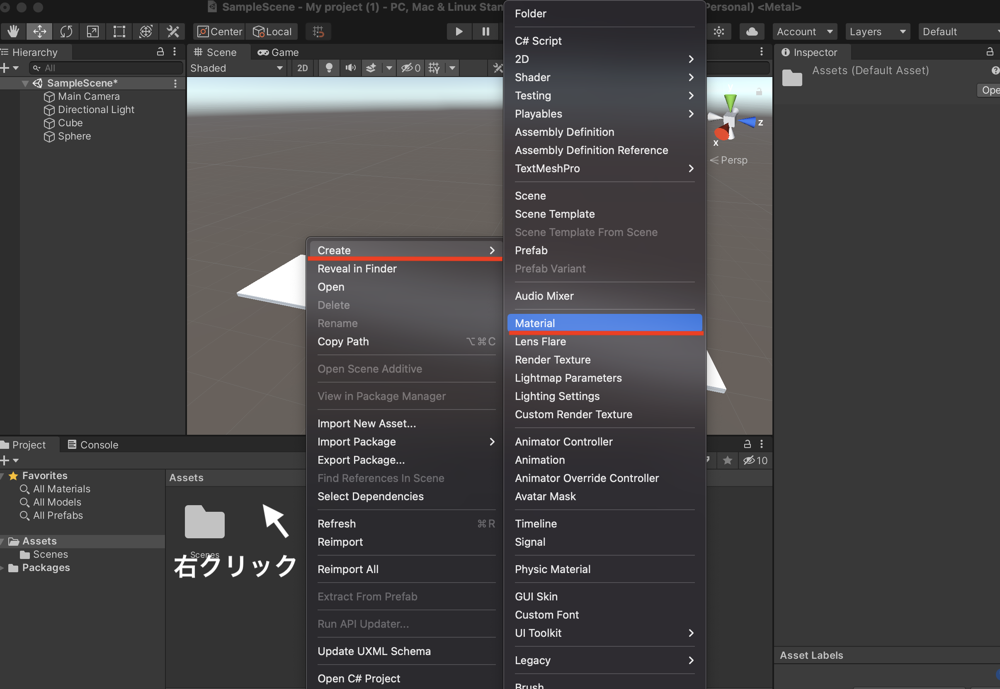
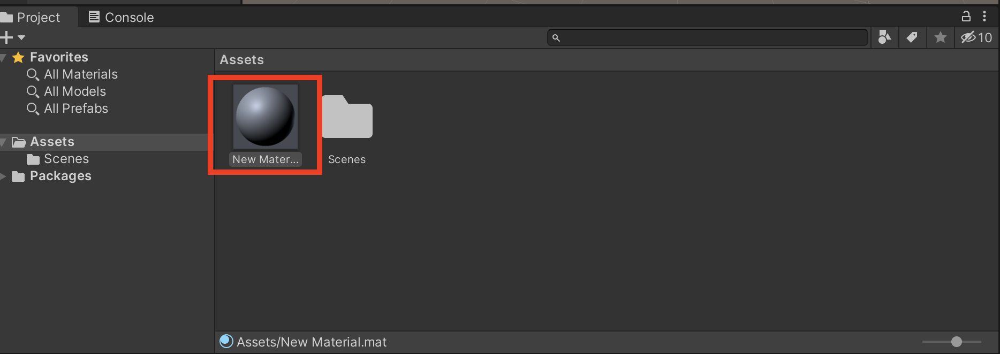
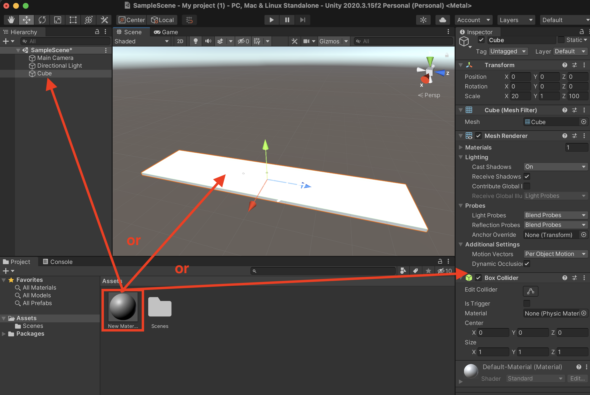
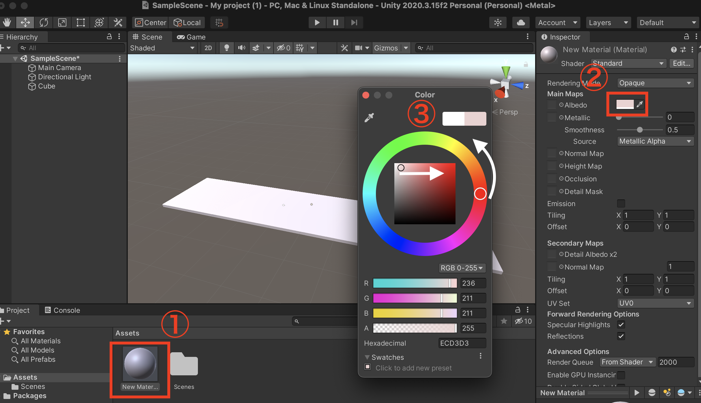
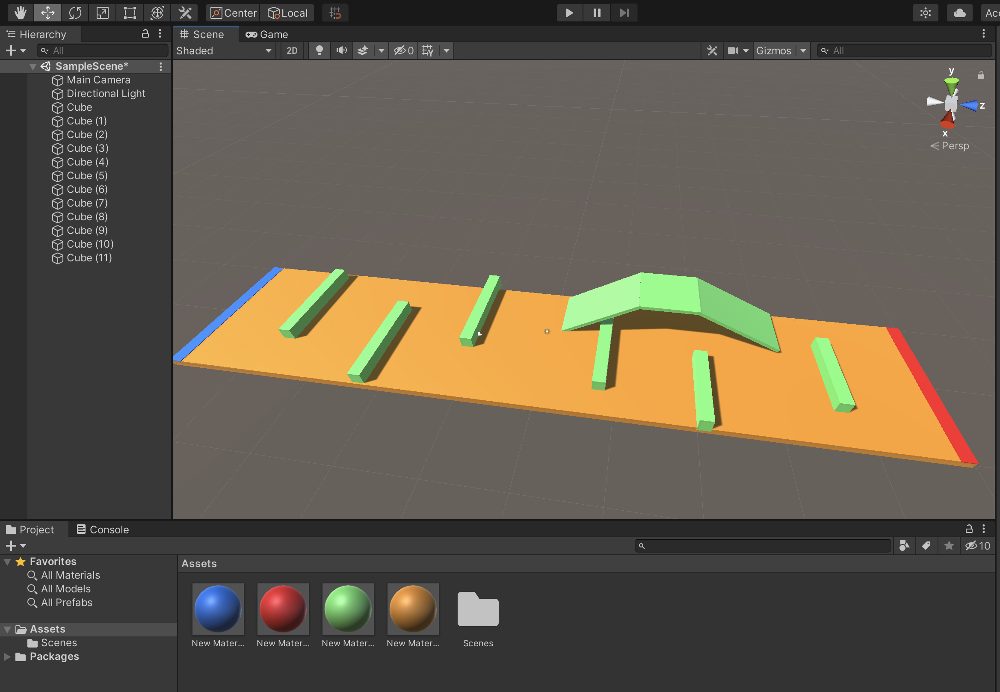

# Unity チュートリアル
## #1 オブジェクトとマテリアル編

前回はUnityのインストールおよびUnityエディタの説明をしました。  
今回から1つのミニゲームを作りきる過程でUnityの基本操作や機能を実際に作りながら説明していきます。作るミニゲーム**ボールランニング**です。このミニゲームを作り切れば、基礎を抑えた上でそこからある程度応用したミニゲームを何本か作る事ができると思います。

### 目次
- ダウンロード&スタート 
- **オブジェクトとマテリアル　←今ここ**
- コンポーネントとスクリプト
- プレファブと当たり判定
- UI
- シーン

## オブジェクト作成
まずは立方体や球体などオブジェクトの追加方法と、それらオブジェクトの座標変更を試しながら、ボールランニングのコースを作っていきます。

ヒエラルキーから右クリックでメニューを開き、3D Object から **Cube**を選択します。  
すると、中央のシーン画面にCubeが追加されます。
Cubeの他にもSphera(球体)やCylinder(円柱)、Plane(平面)など様々なプリミティブオブジェクトがあるので、試して見ましょう。

## 視点の変更
コースを作る前にUnityの操作には欠かせない視点の変更を解説します。
Unityを含めた3Dソフトを扱う場合は、マウスを用意しておくと操作が便利です。
ここでもマウスによる視点変更操作を解説します。

上記で作成したCubeを目印にして、以下の操作を試してみましょう。  

- 右クリック：視点の方向変更
- マウスホイール：ズームイン・アウト
- ホイールクリック：視点の位置変更

この他に下図のようにヒエラルキー上部にあるボタンでクリック時の操作を変更することもできます。

## オブジェクトの座標＆サイズ変更

オブジェクトの大きさと座標を変更してコースを作成していきます。
まず、先ほど作ったCubeを長方形に変形させます。
Cubeを選択すると画面右のインスペクタにCubeの詳細商法が表示されます。
この上段の**Transform**からオブジェクトの位置(Position)、角度(Rotation)、大きさ(Scale)を変える事ができます。

今回は下図のような値にしましょう。後ほど好きな値に変更しても大丈夫です。

## マテリアルの設定
追加されるオブジェクトには色がついていません。色をつけるにはマテリアルを追加します。
プロジェクトで右クリックしてメニューを開き、Create > **Matterial** を選択し、マテリアルをプロジェクトに追加します。

この時点では、プロジェクトにマテリアルを追加しただけなので、オブジェクトにマテリアルは追加されていません。オブジェクトに追加するには、マテリアルを**ヒエラルキーのオブジェクト**か**シーン画面のオブジェクト**、**オブジェクトのインスペクター**にドラックする事で、追加できます。

マテリアルを追加してもオブジェクトの色はまだ変わりません。次はマテリアル自体の色を設定します。マテリアルインスペクターのMainMapsから色を変更できます。するとこのマテリアルを追加したオブジェクトの色も変更されるのが確認できます。

## コースの作成
ここまでできたら、オブジェクトとマテリアルを追加しながらコースを作成してみましょう。
ちなみに、マテリアルは、複数のオブジェクトにつける事ができ、色を変更すると、複数オブジェクトの色を一斉に変える事ができます。下図のようにスタートとゴールがわかるようにできると良いでしょう。

コースは後からでも変更する事ができるので、好きなように作ってみましょう。
