# Unity チュートリアル
## #2 コンポーネントとスクリプト

前回はオブジェクトとマテリアルの追加方法について説明し、ボールランニングのコースまで作成しました。今回はさらに、物理演算(重力)や衝突、プレイヤーを動かすスクリプトの作成まで行います。この章で一気にゲーム感が増して面白くなって行くと思います。


### 目次
- ダウンロード&スタート 
- オブジェクトとマテリアル
- **コンポーネントとスクリプト　←今ここ**
- プレファブと当たり判定
- UI
- シーンの追加


## コンポーネントの追加
コンポーネント(部品)はオブジェクトが持っている機能のことを指し、インスペクターに表示されます。Unityのコンポーネントには様々な機能が用意されていて、物理演算(重力)や当たり判定、など自由に追加、変更が可能です。

それでは早速、物理演算を試してみましょう。  
まずはSphereオブジェクトをシーンに追加し、スタート位置の少し上に配置してみてください。
次に、Main CameraをSphereオブジェクトが映るように移動させましょう。
この状態で中央上の**実行ボタン**を押してみてください。Sphereオブジェクトが浮いているのが確認できると思います。

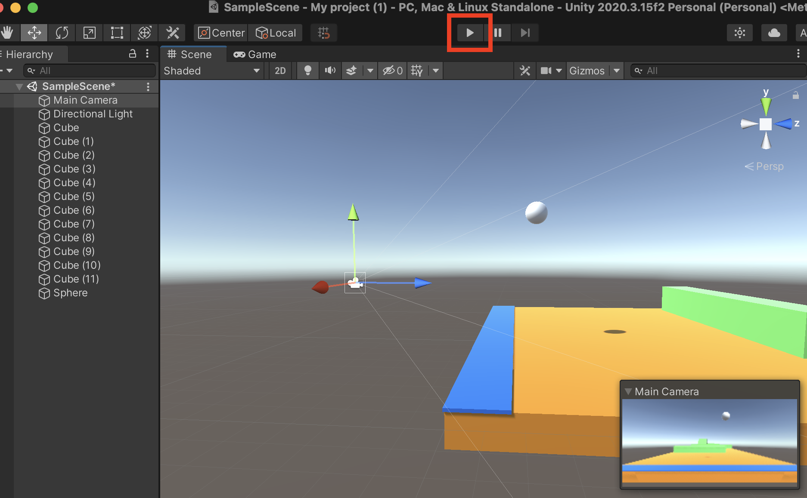

それでは、このSphereオブジェクトに物理演算(重力)コンポーネントを追加したいと思います。
Sphereオブジェクトをクリックし、インスペクターの一番下にある**Add Component**をクリックし、検索に**rig**と入力すると**Rigidbody**が出てきますので、クリックします。
これでSphereオブジェクトのインスペクターにRigidbody(物理演算)が追加されました。

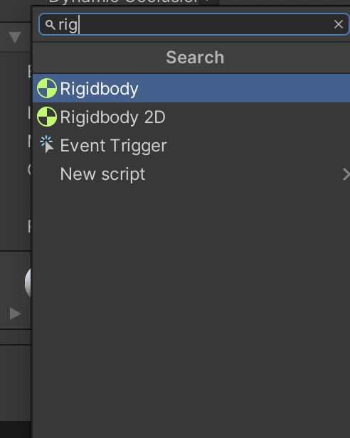
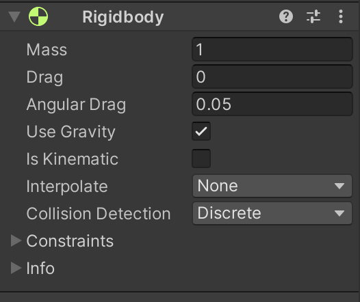

この状態で実行ボタンを押してみてください、先ほどと変わって、重力を与えられたSphereオブジェクトが地面に着地するのが確認できます。

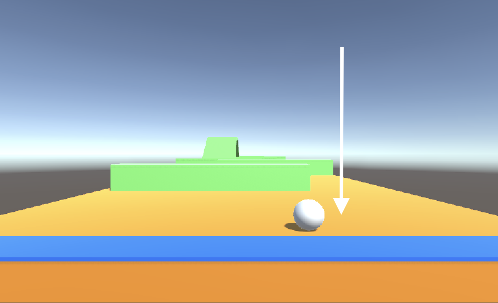

これは先ほど追加したRigidbody(重力)に加え、既にSphereが持っている**Collider(当たり判定)コンポーネント**が作動した事によって、地面に着地する事ができたのです。  
試しに、この**Sphere Collider**の機能を無効にしてみましょう。無効にするにはコンポーネントのチェックを外すことで、機能を無効にできます。

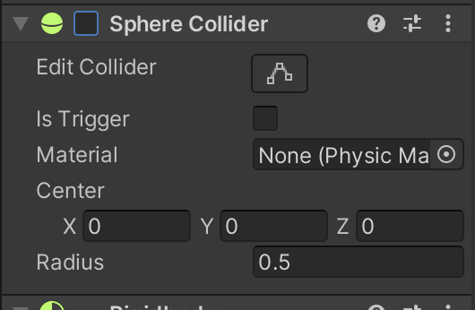

再度実行ボタンを押すと、Sphereが地面をすり抜けて行くのが確認できます。
下のCubeにも標準でColliderが付いていて、当たっている両者にColliderが付いていないと当たり判定は行われません。ちなみに斜面上にSphereを配置すると下に転がっていきます。

## スクリプトの追加
上記で作ったSphereをこのボールランニングゲームのプレイヤーにしたいと思います。
ここからはプレイヤー用のスクリプト(プログラム)を作成し、プレイヤーを動かせるようにしたいと思います。わかりやすいように、Sphereの名前をPlayerに変えておきましょう。
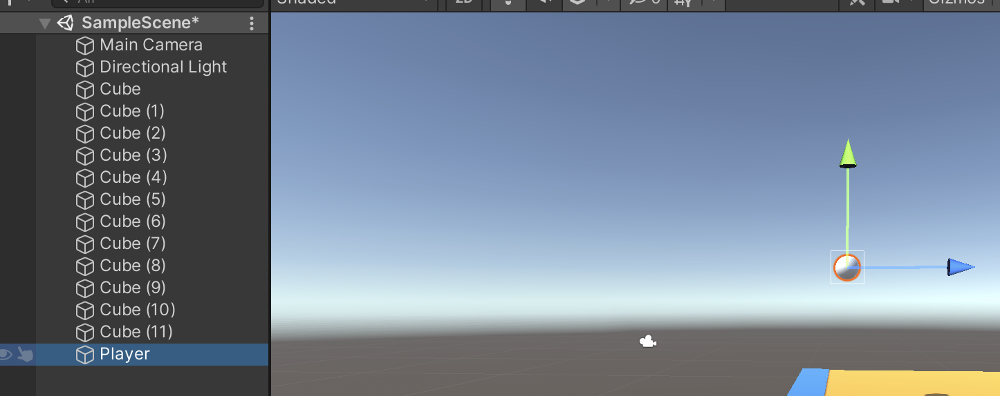

プロジェクトから右クリックで、メニューを開き、Create > **C# Script** をクリックしてスクリプトを追加します。名前は**PlayerMove**にしましょう。
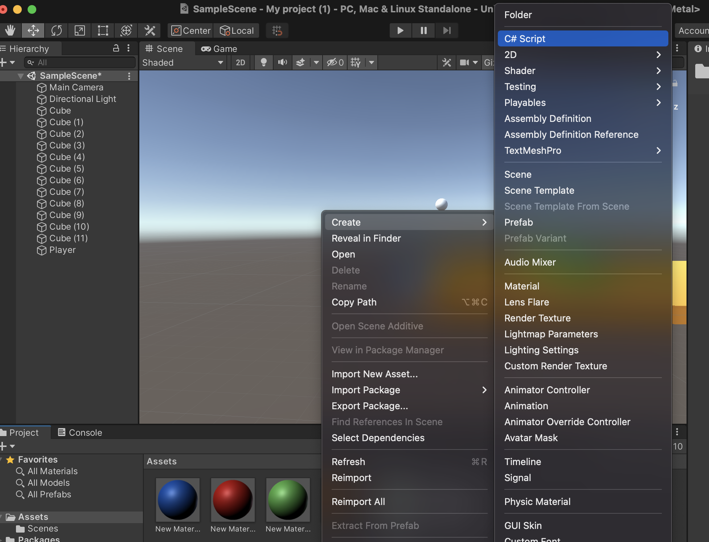

スクリプトを追加したら、ダブルクリックしてスクリプトを**Visual Studio**で開きます。
すると下図のような画面が開きます。
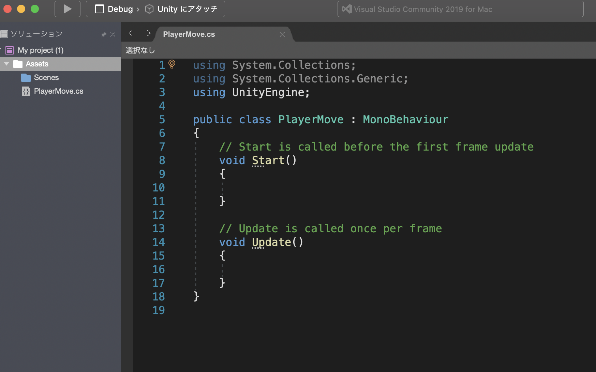

#### using 〜
上3行のusing 〜は他言語でいうimportと同じ役割で、Unityで使う機能を分割して、使えるようにしています。

##### void Start()
void Start()はこのスクリプトが呼び出された時に、一度だけ実行される関数で、座標やパラメータの初期値などを設定する時に使われます。

##### void Update()
void Update()はvoid Start()実行後に繰り返し実行される関数です。  
他言語でいうmain loopやdraw関数と同意です。

ここには、繰り返し実行してほしい処理を記述します。


それでは、まず下記のコードを打ち込んでみましょう。

``` cs
using System.Collections;
using System.Collections.Generic;
using UnityEngine;

public class PlayerMove : MonoBehaviour
{
    Rigidbody rb;

    // Start is called before the first frame update
    void Start()
    {
        rb = this.gameObject.GetComponent<Rigidbody>();
    }

    // Update is called once per frame
    void Update()
    {
        rb.AddForce(new Vector3(0, 0, 1));
    }
}

```
打ち込んだら、マテリアルの時と同様にスクリプトをPlayer(Sphere)にドラックします。
するとインスペクターにこのスクリプトが追加されているのが確認できます。
マテリアルやスクリプトをオブジェクトにドラッグして追加する事を**アタッチ**と言います。
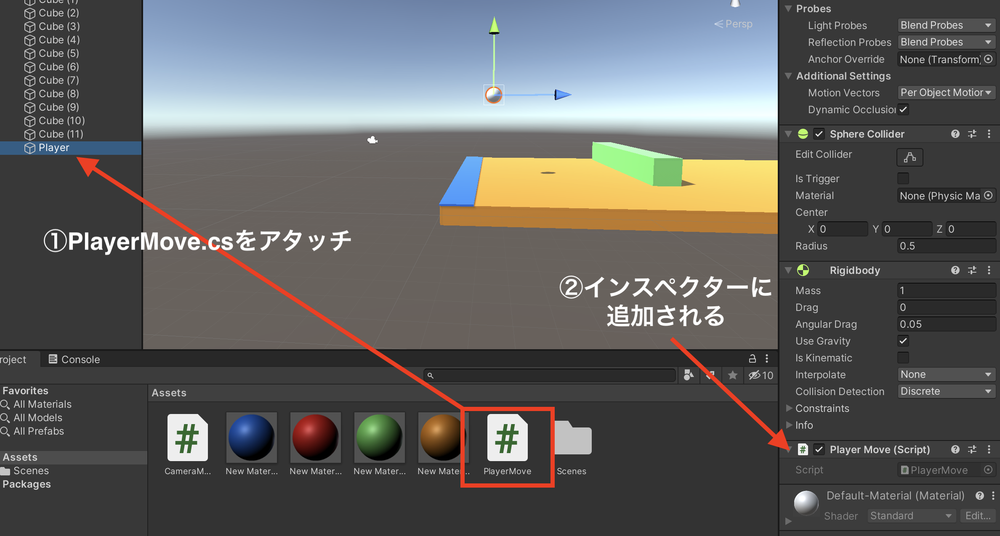


この状態で実行ボタンを押してみましょう。
**Playerが前に転がったでしょうか？**
このスクリプトには、以下のよう内容が書かれています。

-  **Rigidbody rb;**  
このスクリプトでRigidbodyを使えるように"rb"として宣言する
-  **rb = this.gameObject.GetComponent<Rigidbody>();**  
このスクリプトを持つオブジェクトのRigidbodyコンポーネントを取ってきてrbに代入する
- **rb.AddForce(new Vector3(0, 0, 1));**  
rbに(x:0, y:0, z:1)の力を加える。

rbにはPlayerオブジェクトのRigidbodyが入ってくるので、PlayerははZ方向に1の力が加わり、前に進みます。

次に、Update()内に下記のコードを加えてみましょう。

```cs
void Update()
    {
        rb.AddForce(new Vector3(0, 0, 1));
        
        //ここから追加
        if (Input.GetKey(KeyCode.A))
        {
            this.transform.position += new Vector3(-0.1f,0,0);
        } else if (Input.GetKey(KeyCode.D))
        {
            this.transform.position += new Vector3(0.1f, 0, 0);
        }
    }
```

これで実行してみると、今度はA,Dボタンで左右に移動する事ができるようになります。
追加したコードには以下のような意味があります。

 -  **if (Input.GetKey(KeyCode.A))**  
 もし、キー入力された文字が'A'であれば
- **this.transform.position += new Vector3(-0.1f,0,0);**  
このオブジェクトのtransformコンポーネントのpositionに、(-0.1, 0, 0)を加える。

先ほどはオブジェクトの移動にRigidbody(重力)を使って、前方向に力を加え移動させました。
今回は、力を加えるのではなく、座標そのものを0.1ずつ変える事で、移動を行います。
このように、オブジェクトを移動させるだけでも複数の移動方法があるので、その場面にあった方法を選ぶようにすると良いでしょう。

## Main Cameraの追従
ここまででPlayerが進み、ADボタンで左右に移動する事が可能になりました。
最後にMain CameraをPlayerに追従させます。

まずカメラ用のスクリプトを作成します。名前は**CameraMove**にし、下記のコードを打ち込んでみましょう。

```cs
using System.Collections;
using System.Collections.Generic;
using UnityEngine;

public class CameraMove : MonoBehaviour
{

    public GameObject player;
    Vector3 plyPos;
    
    void Start()
    {
        
    }

    // Update is called once per frame
    void Update()
    {
        plyPos = player.transform.position;
        transform.position = new Vector3(plyPos.x, plyPos.y+3, plyPos.z-7);
    }
}
```

打ち込んだら、今度はこのスクリプトを**Main Camera**にアタッチしてみましょう。
するとインスペクターにCameraMoveが追加されるのが確認できます。
しかし、先ほどのPlayerMoveの時と少し違い、**Player [None Game Object]**という欄が
CameraMoveにはあります。

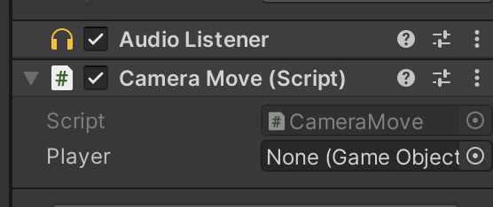

この欄は、コード内でパブリックとして宣言された変数をUnityエディタ側で編集する事ができる
テキストフィールドです。現在コード上で、**Gameobject player**は宣言はされましたが、まだ中身がない状態です。このテキストフィールドを使ってplayer変数に代入する場合、右端の◉マークから代入する対象を選択するか、代入したい対象を直接ドラックして代入することができます。

では、下図のようにヒエラルキーからPlayerをドラッグして、CameraMoveのPlayerにアタッチしてみましょう。

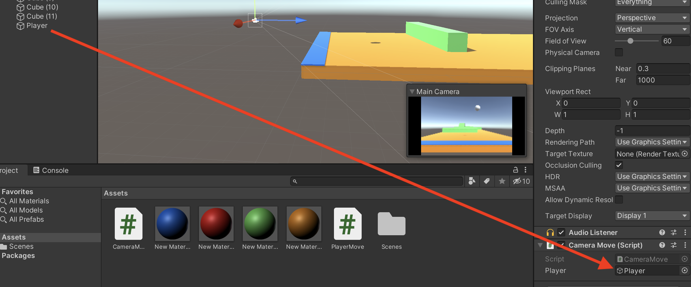

これで、Main Camerが持つCameraMove.cs内の**Gameobject player変数**には、**操作するボールであるPlayerオブジェクト**の情報が代入されたことになります。

そしてCameraMoveのコードを見てみると、以下のような内容が書かれています。

-  **public GameObject player;**  
パブリック変数としてGameObject型のplayerを宣言する
- **Vector3 plyPos;**  
Vector3型(三次元ベクトル)のplyPosを宣言
-  **plyPos = player.transform.position;**  
plyPosにplayer変数内のtransform.positionを代入
- **transform.position = new Vector3(plyPos.x, plyPos.y+3, plyPos.z-7);**  
自分(Main Camera)の座標に、plyPosのyとz座標に数値を加えたもの(x, y+3, z-7)を代入する。

つまり、**Playerの座標にy＋3、z-7をしたものをMin Cameraの座標**とするという処理をUpdateの中でやっているので、常にMain Cameraの座標がPlayer後方に更新されるわけですね。
これでさらにゲーム感が増しましたね、次章ではコインを追加してコインを集められるようにしたいと思います。


