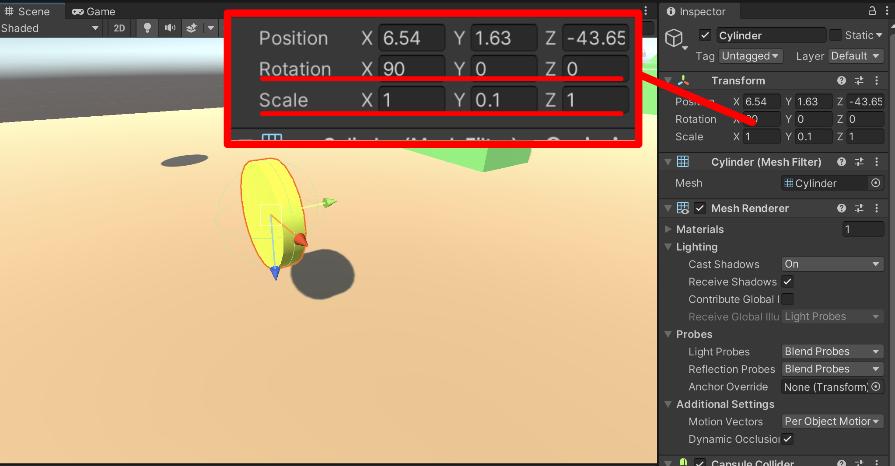
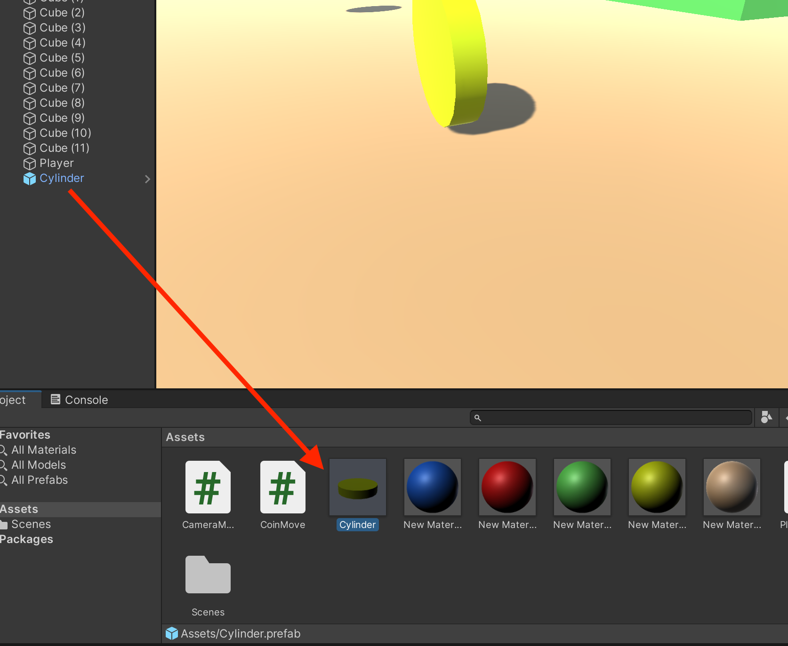
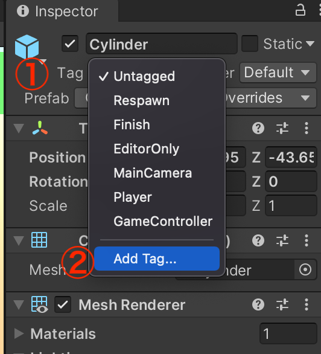
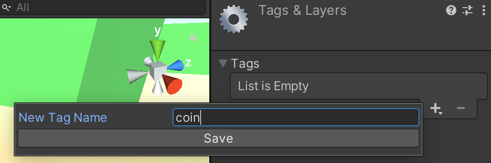
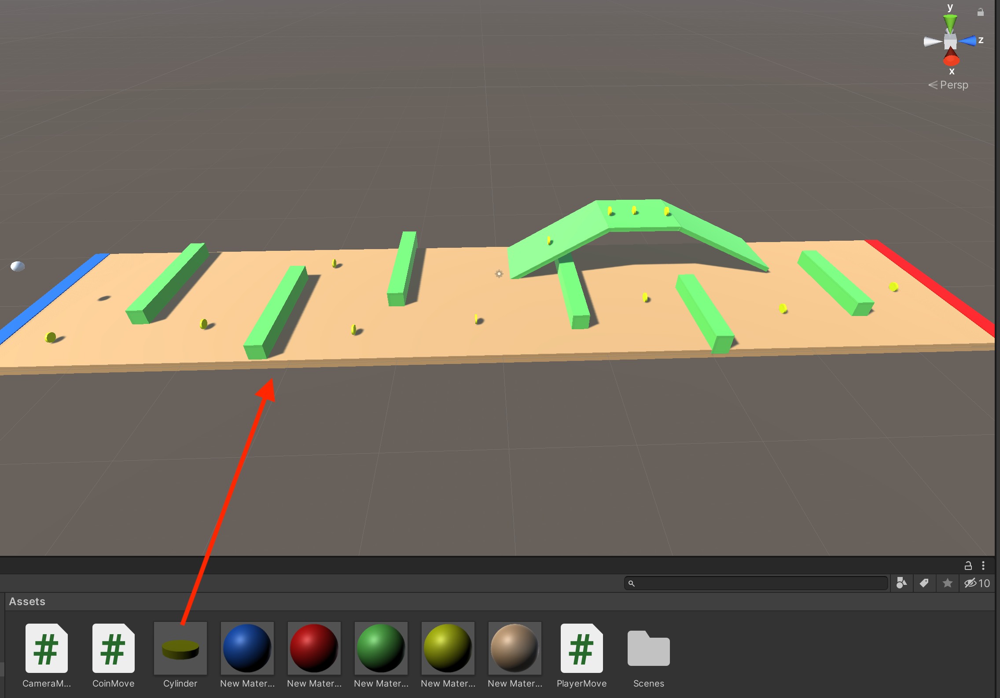

# Unity チュートリアル
## #3 プレファブと当たり判定

前回はコンポーネントの追加とスクリプトを記述し、Playerを動かせるようにしました。
今回はさらに、プレファブという概念を用いて、コインをコース上に複数配置し、コインを集められるようにしたいと思います。


### 目次
- ダウンロード&スタート 
- オブジェクトとマテリアル
- コンポーネントとスクリプト　
- **プレファブと当たり判定　←今ここ**
- UI
- シーンの追加

## プレファブ
プレファブとは、簡単にいうとオブジェクトのコピーを作成する仕組みのことです。
コースを作成する際に、Cubeをヒエラルキーから1つずつ追加しましたね。
あの方法だと、何も機能を持たないまま生成されてしまうので、同じ機能を複数持たせたい場合など、全てのオブジェクトにアタッチするのは少し面倒です。

そこで、1つのオブジェクトに複数の機能を持たせた状態でプレファブ化することによって、同じ機能を持ったコピーをいくつも作成することが可能になるのです。とても便利ですね。

では早速コインを1つ作り、プレファブ化して見ましょう。
今回は簡易的に、3D Objectの**Cylinder**に黄色のマテリアルをつけたものをコインにします。
大きさと角度を調節して、コインぽくしましょう。



さらに、スクリプトを加えて、回転するようにします。スクリプト名は**CoinMove**にし、下記のコードを書き込んでみましょう。

```cs
using System.Collections;
using System.Collections.Generic;
using UnityEngine;

public class CoinMove : MonoBehaviour
{
    // Start is called before the first frame update
    void Start()
    {
        
    }

    // Update is called once per frame
    void Update()
    {
        transform.Rotate(new Vector3(0,0,1));
    }
}
```


上記のコードでは、Z軸が縦になっているときに、Z方向に回転を加えることで、コインが横回転しているように見えます。縦軸が異なる場合は縦軸に合わせて、Rotateの数値を変更しましょう。打ち込めたら、Cylinderにスクリプトをアタッチしましょう。

これで最初のCylinderに、マテリアルとスクリプトの機能を持たせたオブジェクトが完成しました。
それでは、このオブジェクトをプレファブ化したいと思います。
方法は簡単です、ヒエラルキーのCylinderをプロジェクトにドラックするだけです。
プロジェクトに追加されたCylinderプレファブのインスペクターを見てみると、先ほど追加したマテリアルと、スクリプトが追加されているのが確認できます。



## スクリプトによる当たり判定
それでは、先ほど作成したコインをPlayerが触れたら、ゲット(消える)ようにしたいと思います。

それでは、前回作成した**PlayerMove.cs**を開いて、下記のコードを追加して見ましょう。

```cs
void Update()
{
	〜
}
//ここから追加
private void OnCollisionEnter(Collision collision)
{
    if (collision.gameObject.tag == "coin")
    {
        Destroy(collision.gameObject);
    }
}

```

- **OnCollisionEnter(Collision collision)**  
Colliderコンポーネントを持つオブジェクト通しが触れた時に作動する(collisionには触れた相手の情報が入っている)
- **if (collision.gameObject.tag == "coin")**  
もし、触れた相手(collision)のオブジェクトの**Tag**が**"coin"**だったら
- **Destroy(collision.gameObject);**  
当たった相手のオブジェクトを削除する


コードを打ち込んだら、次にCylinderプレファブのインスペクターから**Tag**の設定を行います。
**Tag > Add Tag...**をクリックします。 



＋マークをクリックし、New Tag Nameに**coin**と入力し、Saveボタンを押します。



そして、再度CylinderプレファブのインスペクターからTagを開くと、coinが追加されているので、クリックしてダグを設定します。


これで、Playerがcoinタグを持ったオブジェクトに触れる事で、coinタグを持ったオブジェクトを消す事ができます。それでは、先ほど作成したCylinderプレファブをシーン画面にドラックして、コース上の好きな位置に配置してみましょう。



これで、毎回マテリアルやスクリプトを追加する手間が省けました。ちなみにスクリプト内からでもプレファブ化したオブジェクトをシーンに追加することも可能です。


