# Unity チュートリアル
## #5 シーンの追加

前回はUIを使って、時間経過とコインカウンターを追加しました。
今回はさらに、シーンの追加をして
スタート画面とゴール画面を追加したいと思います。

シーンとはざっくり言うとUnityの空間を指し、スタート画面、ゲーム中の画面、ゴール画面など、空間を分けて作りたい時に、シーンを追加する事で、現在の作業空間とは別の空間を作る事ができるのです。


### 目次
- ダウンロード&スタート 
- オブジェクトとマテリアル
- コンポーネントとスクリプト　
- プレファブと当たり判定
- UI
- **シーンの追加　←今ここ**

## スタート画面

では早速シーンの追加をやってみましょう。まずプロジェクトからScenesフォルダを開き、
右クリックからメニューを開いて、**Create > Scene**を選択しシーンを追加します。名前は**StartScene**にしましょう。

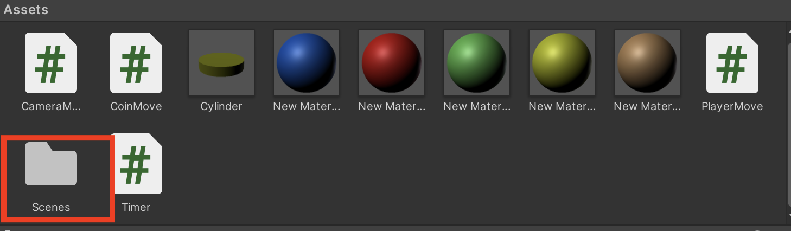
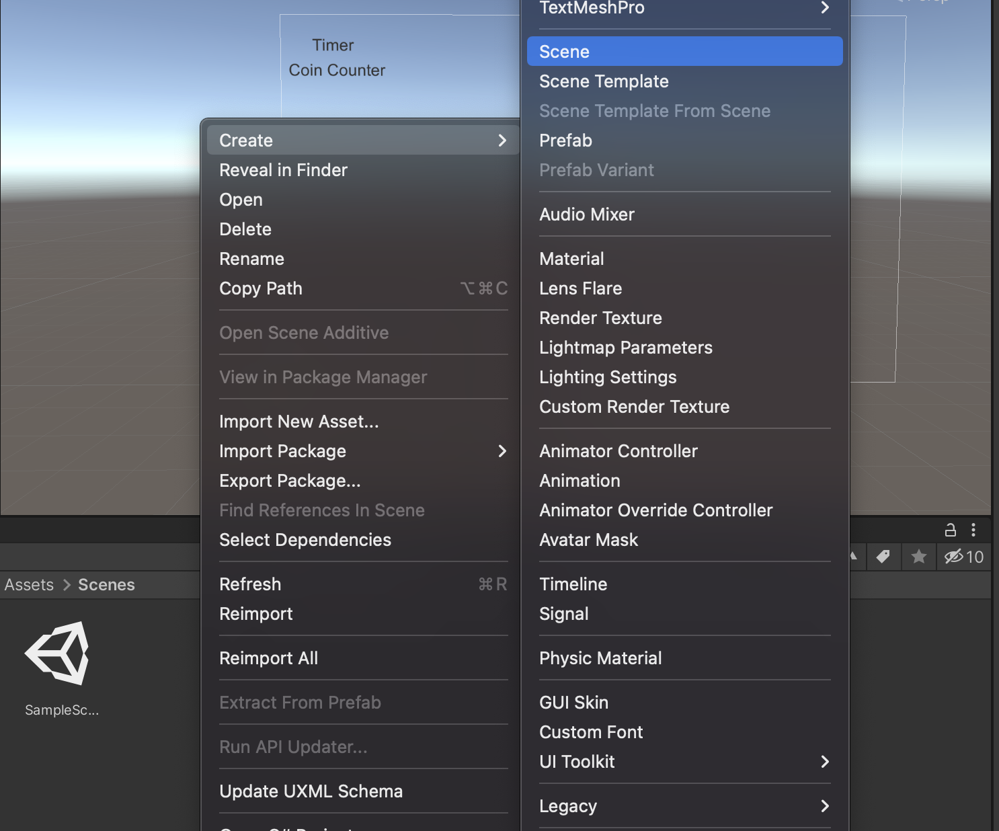
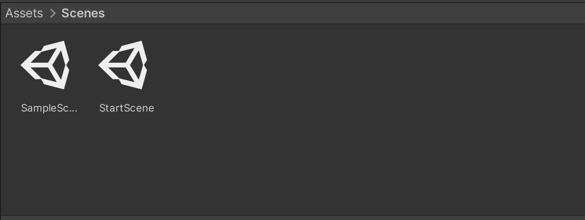

StartSceneをクリックして開くと、何もないUnityの空間が現れます。
ここにスタート画面を作ります。
では初めに、ヒエラルキーに右クリック、**UI > Text** からテキストを追加し、ゲームのタイト名を入れましょう。画面中心に配置し、大きさも任意の大きさに設定しましょう。

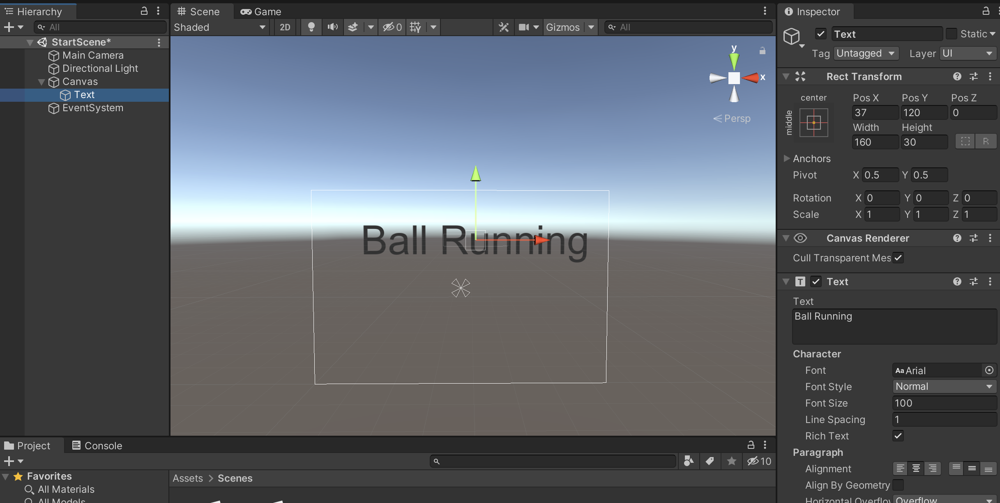

背景がUntyの空間そのものなので、単色に塗り潰したいと思います。Main Cameraを選択し、インスペクターの**Clear Flags**で**Solid Color**を選択します。すると、その下の**Background**で選択されている色に背景が変更されます。好きな色に変えてみましょう。

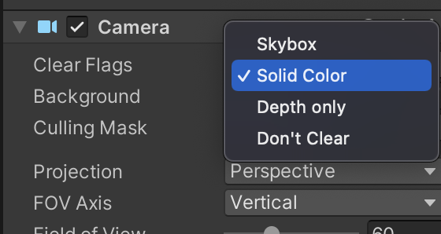
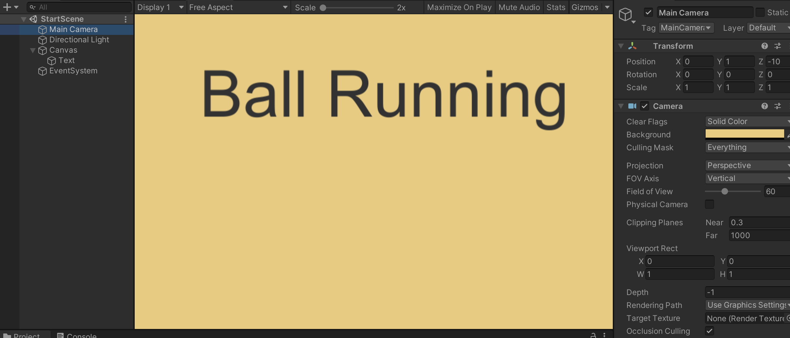

## ボタンの追加
次は、ゲームを開始するためのスタートボタンを追加します。
ヒエラルキーの**Canvasに UI > Button**を選択します。ヒエラルキーに追加されたButtonを見てみると、**下階層にText**があるのがわかります。ここからButtonに表示されている文字を変更
する事ができます。

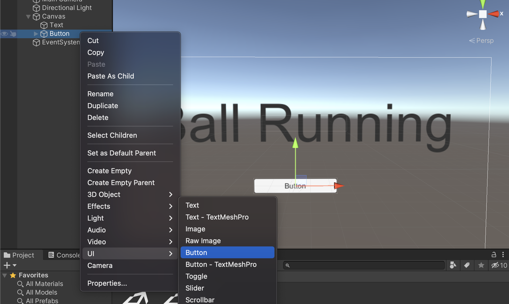
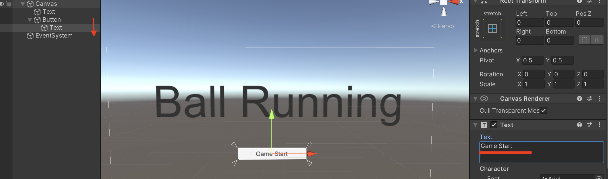

次に、ボタンが押されたらゲームシーンに移動するようにしたいと思います。
今作ったUI Buttonに**GameStart.cs**というスクリプトを作成、追加し下記のコードを打ち込みましょう。

```cs
using System.Collections;
using System.Collections.Generic;
using UnityEngine;
using UnityEngine.SceneManagement;

public class GameStart : MonoBehaviour
{
    public void OnClickStartButton()
    {
        SceneManager.LoadScene("SampleScene");
    }

}
```

- **using UnityEngine.SceneManagement;**  
SceneManagement機能を追加
- **public void OnClickStartButton()**  
独自の関数を定義
- **SceneManager.LoadScene("SampleScene");**  
この関数が呼び出された時にSampleSceneという名前のシーンをロード

Buttonのインスペクターの**LIst is Empty**の＋マークを押し、Noneの箇所にButtonオブジェクト自体をアタッチします。そして、**None Function**から**GameStart  > OnClickStartButton()**を選択します。これで、ボタンが押さえたら、OnClickStartButton()が呼び出されます。

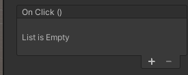
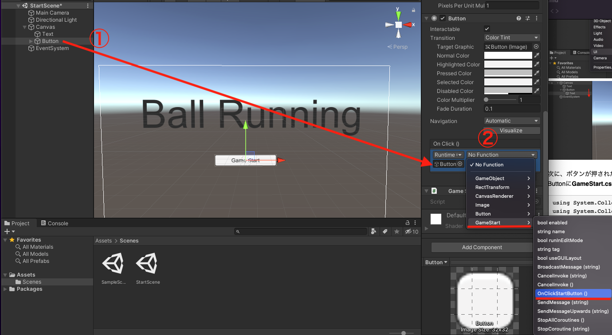


そして、File > Build Setting からScene in Build に2つのシーンをドラックして追加します。
　
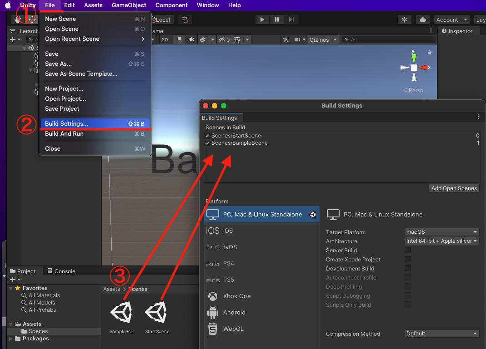
これでStartSceneから実行してGame Startボタンを押すと、SampeSceneに遷移する事ができます。

## クリア画面の追加
スタート画面の次は、ゴール画面を作成します。
先ほどと同様に、プロジェクトのScenesに**右クリック > Create > Scene** からシーンを追加します。名前は**GoalScene**にしましょう。

そして、GoalSceneには、StartSceneと同じように、**UI > Text**でGoalの文字を入れましょう。
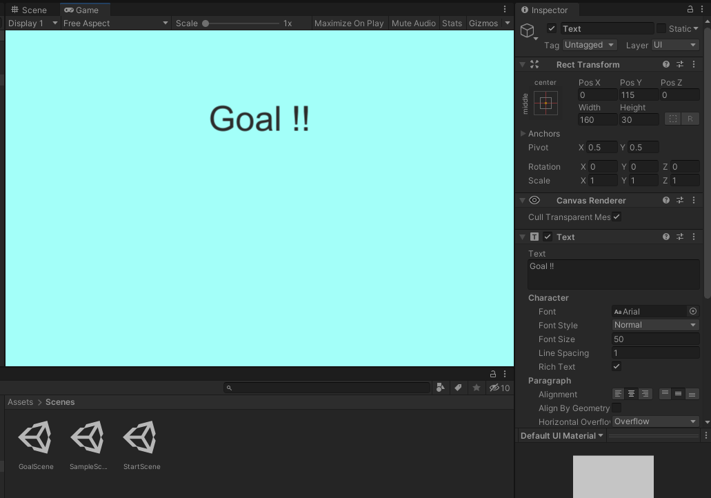

そして、ゲームシーン(SampleScene)に戻り、ゴールの目印にしているオブジェクトに触れたら、GoalSceneに遷移するようにしましょう。
今回は、コインの時と同じように、ゴールの目印にしているオブジェクトに"goal"タグをつけて、
OnCollisionEnterで判定を行います。下記のコードを**PlayerMove.cs**に追加しましょう。

```cs
〜
using UnityEngine.SceneManagement;

public class PlayerMove : MonoBehaviour
{
	void Start()
    	{
       		〜
    	}
   	void Update()
    	{
    		〜
    	}
    	
    private void OnCollisionEnter(Collision collision)
    	{
	    	if (collision.gameObject.tag == "coin")
	        {
	           	〜
	        }
	        else if(collision.gameObject.tag == "goal")
	        {
	            SceneManager.LoadScene("GoalScene");
	        }
    	}
}

```

このように、これまで書いてきたコードを組み合わせて、**goalタグ**を持っているオブジェクトに触れたら、**GoalScene**に遷移するようにできますね。

そしたら、ゴールの目印オブジェクトに**goalタグ**をつけ、File > Build Setting のScene in Buildに**GoalScene**追加しましょう。

これでGoalSceneに遷移する事が可能になりました。

## クリアタイムと得点の表示
せっかくなので、クリア時にクリアタイムとコインの取得数をクリア画面に表示したいと思います。
ここで重要なのは、Aのシーンの変数をBのシーンに渡す事ができるというのがミソです。

方法はいくつかありますが、ここでは**public static**変数を使います。これによって、どこからでもこの変数を参照する事が可能になります。
PlayerMove.csのcoinCount変数とTimer.csのtime変数を下記のように書き換えましょう。

```cs
//PlayerMove.cs
public static int coinCount = 0;

//Timer.cs
public static float time;

```

次に、GoalSceneに移りヒエラルキーからCanvasに新しいTextを追します。  
そして、Textに**DrawTimeAndCoin.cs**というスクリプトを追加し、下記のコードを打ち込んでみましょう。

```cs
using System.Collections;
using System.Collections.Generic;
using UnityEngine;
using UnityEngine.UI;

public class DrawTimeAndCoin : MonoBehaviour
{
    Text timeAndCoin;
    string goalTime;
    string coinNum;

    void Start()
    {
        timeAndCoin = GetComponent<Text>();
        goalTime = Timer.time.ToString("F2");
        coinNum = PlayerMove.coinCount.ToString();
        timeAndCoin.text = "Time : " + goalTime + ", Coin : " + coinNum;
    }
}
```

- **goalTime = Timer.time.ToString("F2");**  
Timerスクリプトのtime変数を文字型に変換して代入する
- **coinNum = PlayerMove.coinCount.ToString();**  
PlayerMoveスクリプトのcoinCount変数を文字形に変換して代入する

これで、SampleSceneからGoalSceneに遷移した時に、Timerスクリプトのtime変数と PlayerMoveのcoinCount変数を取得する事ができました。
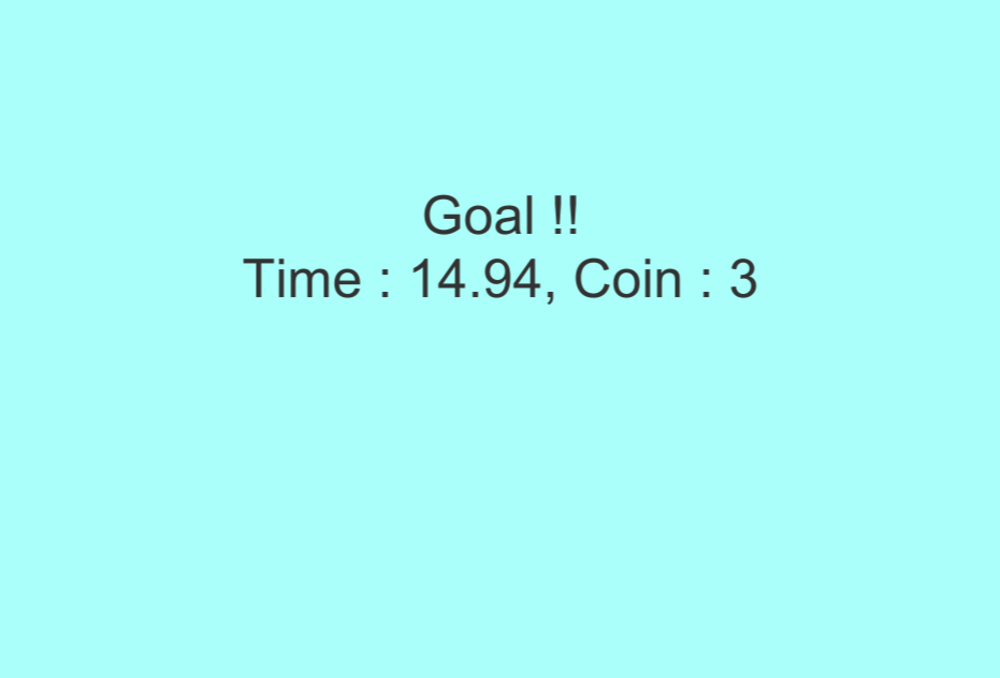


## 最後に
これにてチュートリアルは終了です。一通りUnityでよく使う処理や、機能などを説明してきました。
これである程度Unityに慣れたのではないでしょうか？この基礎を軸に、他のゲームを作ってみたり、
他リファレンスを参考に、Unityを触ってみると良いと思います。



