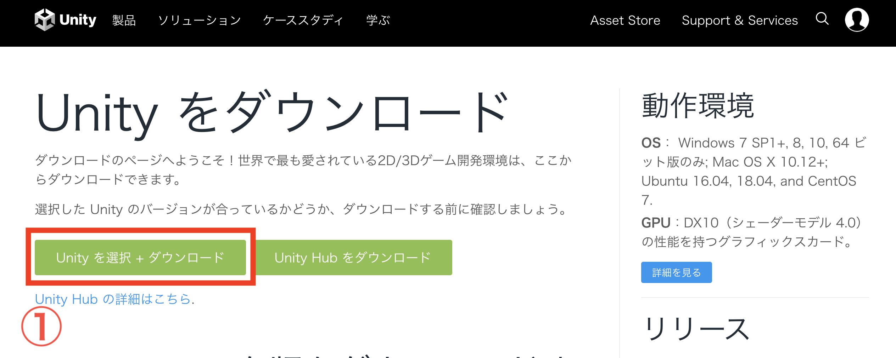
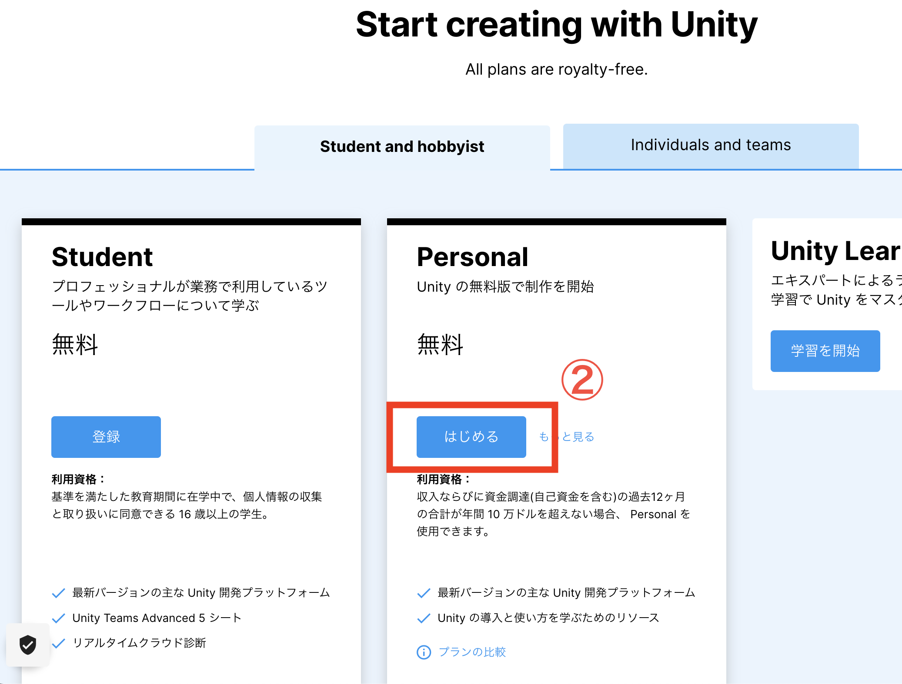
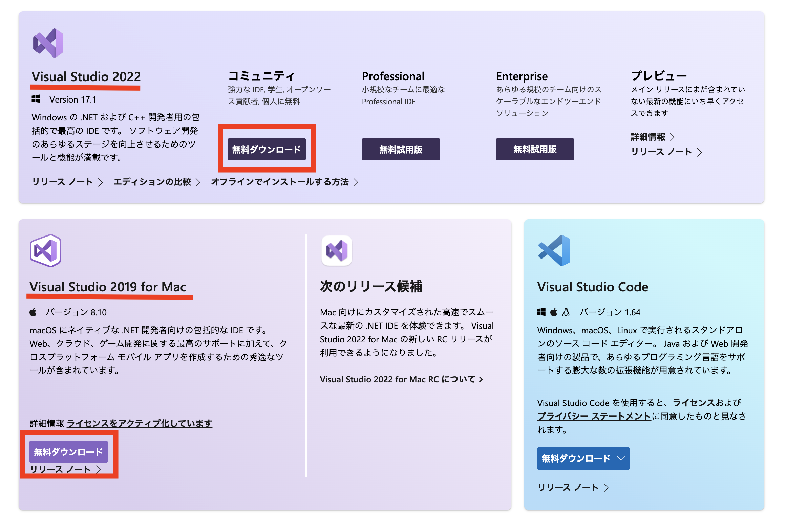
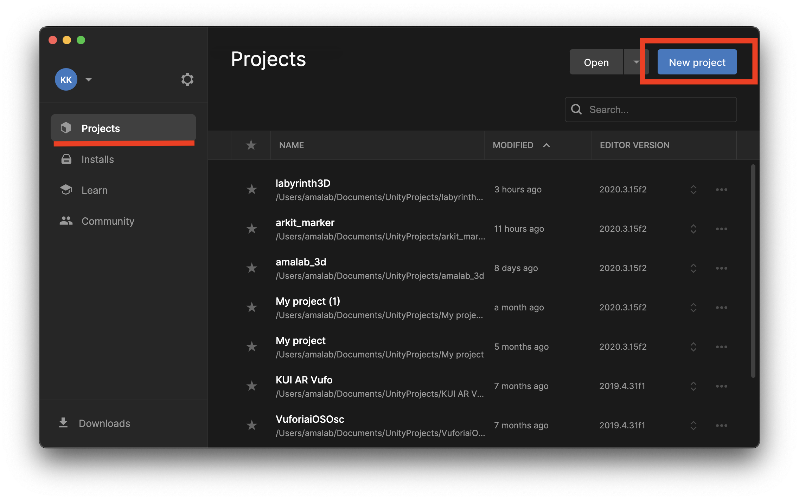
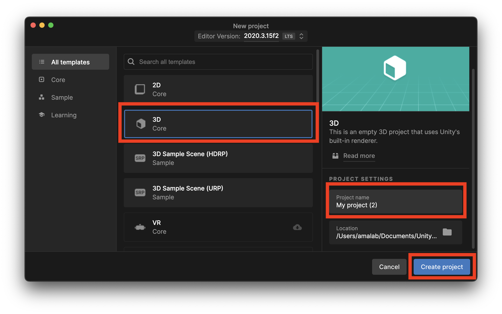
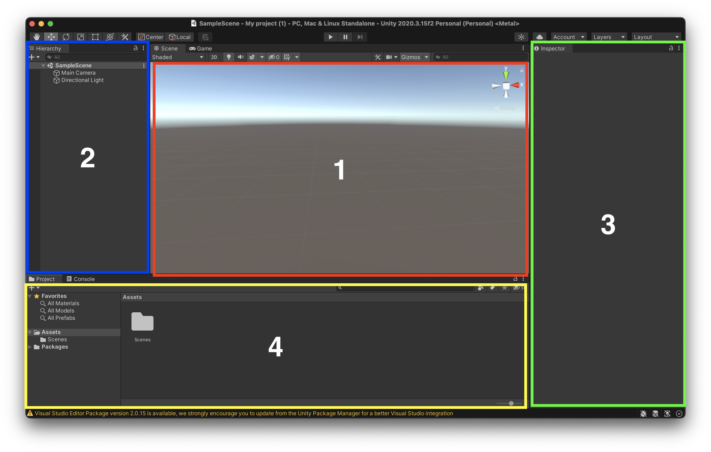

# Unity チュートリアル
## #0 ダウンロード&スタート編

- **ダウンロード&スタート 　←今ここ**
- オブジェクトとマテリアル
- コンポーネントとスクリプト
- プレファブと当たり判定
- UI
- シーン

## UnityHub＆Unityダウンロード

最近のUnityでは年毎にバージョンをあげてリリースをしています。
そのため、2018年バージョンでは動いていたプログラムが2022年バージョンでは動かないなんてことは頻繁にあります。

そのため、Unityをダウンロードする際は、バージョン管理ツールである**UnityHub**をダウンロードしUnityHubからUnityをダウンロードします。

[Unity Hub ダウンロードページ](https://unity3d.com/jp/get-unity/download)

上記リンクからUnity Hubと最新バージョンUnityのセットをダウンロードします。
ダウンロードには数分かかります。

## Visual Studioダウンロード
Unityのスクリプト(プログラム)を書く際に必要なエディタとして**Visual Studio**をダウンロードします。他のエディタでも代用は効くので、軽量な方がお好みであればVSCodeをお勧めします。

[Visual Studioダウンロードページ](https://visualstudio.microsoft.com/ja/downloads/)

上記リンクからMacまたはWIndowsを選びダウンロードします。

**Unity Hubもそうですが、Visual Studioでもアカウント認証を求められると思うので、適当なメールアドレスでUnityアカウントとMicrosoftアカウントを作成してログインしましょう。**

## Projectの新規作成とUnityエディタについて
UnityHubとVisual Studioをインストールしたら、UnityHubを開いてみましょう。  
**Installs**を見てみると最新バージョンのUnityがインストールされていると思われます。  
そうでない場合は**Install Editor**から最新バージョンをインストールしましょう。

インストールできている場合は、**Project**から**New Project**を押してプロジェクトを新規作成して見ましょう。

作りたいゲームによって2Dや3Dなど選択できます。今回は3Dを選択して、プロジェクト名を決めて**Create Project**でプロジェクトを作成しましょう。

新規作成すると以下のようなUnityエディタが立ちあがります。
Unityエディタの画面は大まかに4つに分割することができます。

- 1. シーン画面：配置したオブジェクトやカメラの位置など確認、移動調整できる(神様視点)
- 2. ヒエラルキー：シーン画面に配置されているオブジェクトのリストが表示される。ここからオブジェクトの追加が可能
- 3. インスペクター：選択したオブジェクトが持つ機能の詳細情報を確認、変更、追加する事ができる
- 4. プロジェクト：プロジェクトのディレクトリが表示される。ここにスクリプトや素材(マテリアル、画像)などを置く事ができる

画面レイアウトは自由に変更できるので、操作に慣れてきたら変更しても良いでしょう。インスペクターの上にレイアウト変更タブがあるので、好みのレイアウトにしても良いでしょう。(慣れない内はデフォルトが良いと思う)

