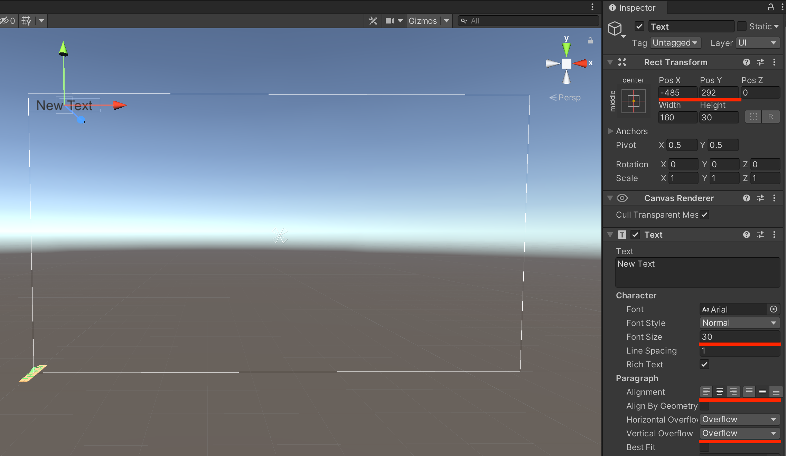
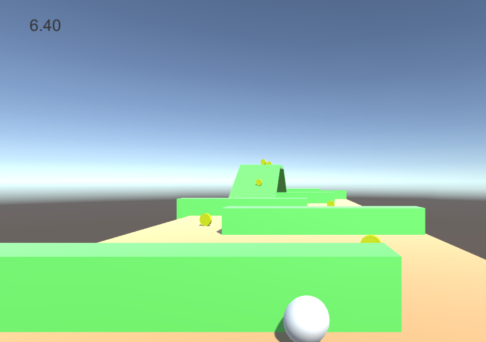
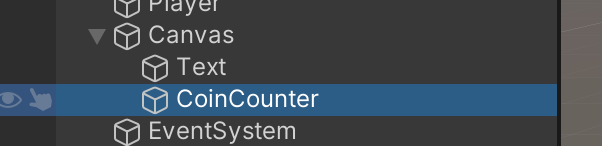
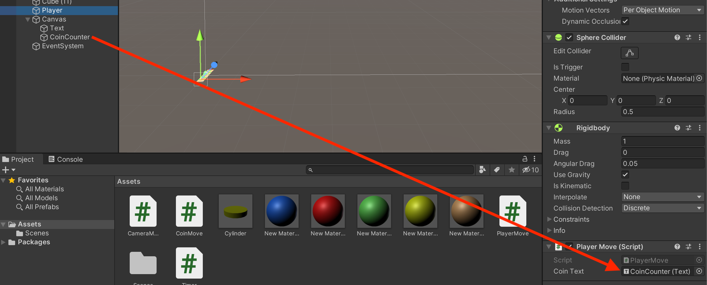
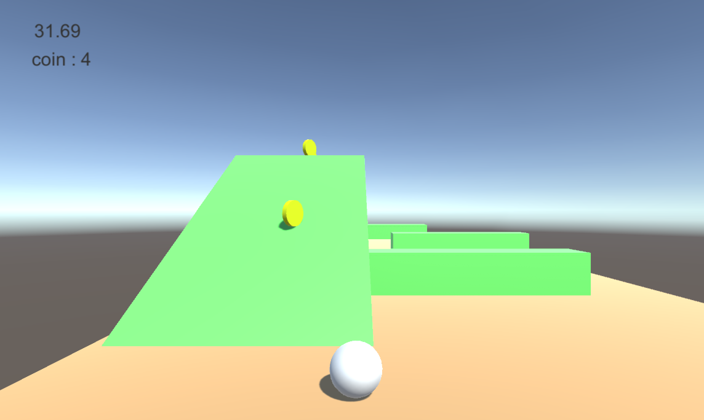

# Unity チュートリアル
## #4 UI

前回はオブジェクトのプレファブ化とスクリプトによる当たり判定とオブジェクト削除の方法を説明しました。
今回はさらに、UIを追加してタイムと、ゲットしたコインの数を表示したいと思います。


### 目次
- ダウンロード&スタート 
- オブジェクトとマテリアル
- コンポーネントとスクリプト　
- プレファブと当たり判定
- **UI　←今ここ**
- シーンの追加

## 時間の表示
まずは、経過時間の表示からやりたいと思います。
ヒエラルキーから**UI > Text**を選択します。
すると、ヒエラルキーに**CanvasとEventSystem**が追加されます。
ゲーム実行画面にはNew Textという文字が画面左下につかされます。このUI Textを使って時間経過を画面に表示します。

それでは、まず画面左下では見づらいので、下図のようにインスペクターを変更して、左上にテキストが来るようにしましょう。Alignmentは中央揃えにし、HorizonalOverflowとVerticalOverflowはOverFlowを選択しましょう。



次に、Canvas > Textにスクリプトを追加します。スクリプト名は**Timer**にしましょう。

```cs
using System.Collections;
using System.Collections.Generic;
using UnityEngine;
using UnityEngine.UI;


public class Timer : MonoBehaviour
{
    Text timerText;
    float time;

    void Start()
    {
        timerText = GetComponent<Text>();
    }

    // Update is called once per frame
    void Update()
    {
        time += Time.deltaTime;
        timerText.text = time.ToString("F2");
    }
}

```

- **using UnityEngine.UI;**  
UIの機能を使う追加
- **timerText = GetComponent<Text>();**  
Text型のtimerTextに自身のTextコンポーネント代入
- **time += Time.deltaTime;**  
前フレームからの経過時間(deltaTime)を加算していく
- **timerText.text = time.ToString("F2");**  
timerTextのtextコンポーネントに経過時間を文字型に変換して代入(小数点第二位まで)

これで、左上に経過時間を表示する事ができました。




## コインカウンター
続いて、ゲットしたコインの数をカウントし表示するためのUIを追加します。

ヒエラルキーのCanvasにさらに**UI > Text**を追加します。名前を区別できるように**CoinCounter**に変更しましょう。


先ほどと同様に、テキストの位置やフォントサイズをインスペクターから変更し、任意の位置にカウンターを配置しましょう。

次にスクリプトを作成するのですが、先ほどはCanvasのTextにスクリプトを作成しましたが、
今回は、Playerが持つ**PlayerMove.cs**にコード追加します。下記のコードを追加しましょう。

```cs

using UnityEngine.UI;

public class PlayerMove : MonoBehaviour
{
    public Text coinText;
    int coinCount = 0;
    
    void Start()
    {
    			〜
    }
    void Update ()
    {
    			〜
    		coinText.text = "coin : "+coinCount.ToString();
    }
    private void OnCollisionEnter(Collision collision)
    {
        if (collision.gameObject.tag == "coin")
        {
            		〜
            coinCount++;
        }
    }
 }

```

- **using UnityEngine.UI;**  
UIの機能を追加
- **public Text coinText;**  
Text型のcoinTextを宣言
- **coinCount++;**  
当たり判定が行われたときに、coinCountをカウントアップ
- **coinText.text = "coin : "+coinCount.ToString();**  
coinTextに"coin : "の文字とcoinCountを文字型にしたものを代入

コードを打ち込んだら、**coinTextにCoinCounterをアタッチしましょう。**



これで、コインをゲットするとコインカウンターUIの数字が変化するのが確認できます。




